# Tryhackme CTF: Pickle Rick

## General information

- Name: Pickle Rick
- Difficulty: Easy
- Date: 27/05/2025

## Tools 

- nmap
- gobuster
- netcat

## Walkthrough

To start I scanned the objective machine using nmap. Used the full scan to retrieve as much information as possible since detection is not a problem here.

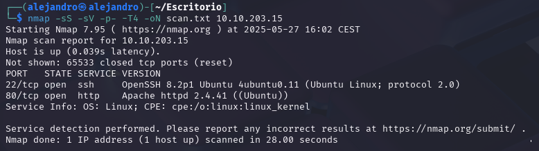

After that I accessed the web service from the browser. After checking the source code I found a relevant comment and a possible relevant classic directory /assets

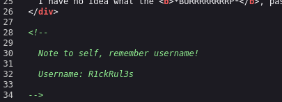
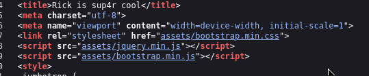

With that initial information gathered I decided to enumerate directories in the server to start looking for vulnerabilitys with gobuster:

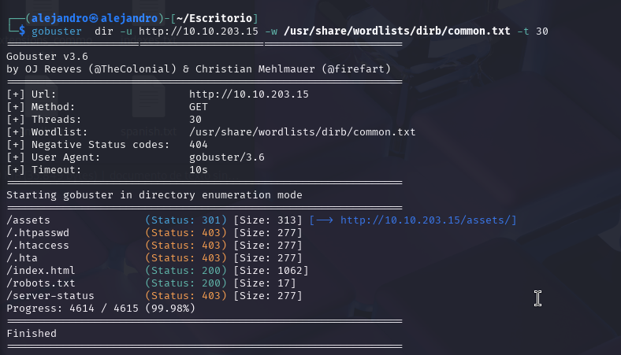

Some relevant information is found here, specially the /robots.txt file.

Tried to access and enumerate all the directories listed with no success except for robot.txt which was not protected.

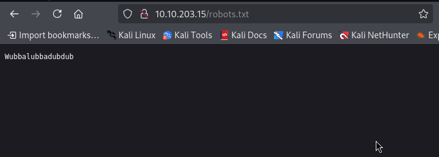

With that and after some unfructuous exploration I decided to go with a more in depth fuzzing over the root directory and found a login.php file.

Once accessed through the browser we get a login interface where we try the information gathered before.

With the username commented and the contents of robot.txt we get a successfull login. It leads us to a command input page.

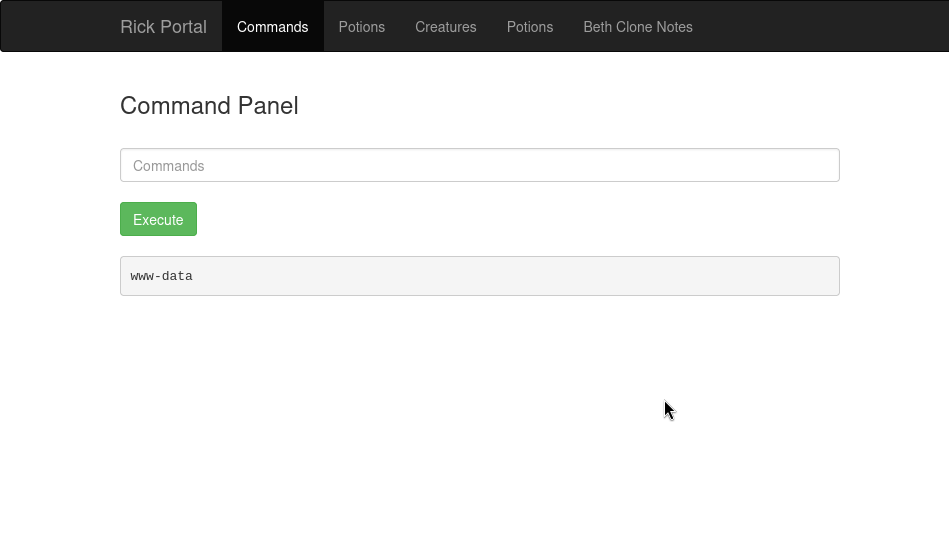

From here I checked if I actually had permission to actually run commands from here. I was able to but some of them were disabled so I could not access files.

From there I decided to get a reverse shell using netcat.

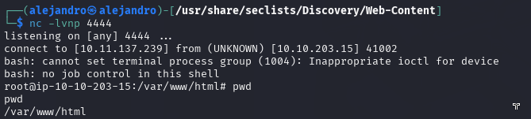
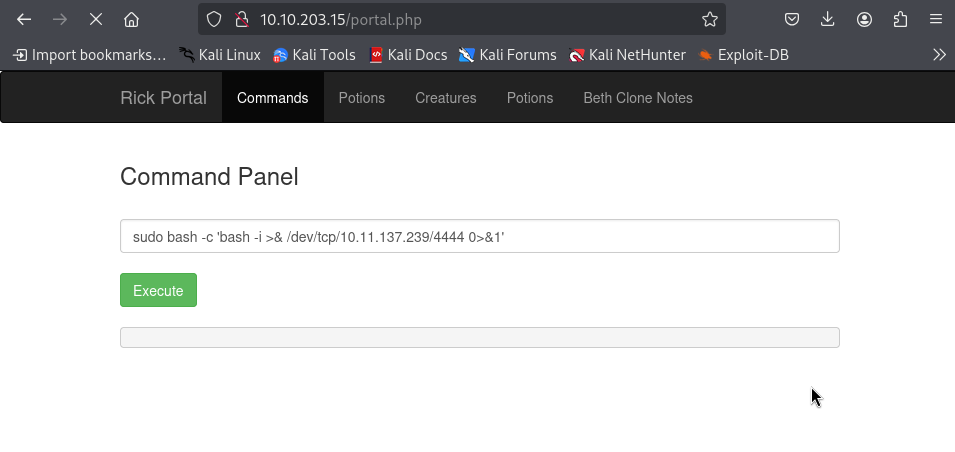

Once the reverse shell was established I was able to read the first flag from the html directory and got root access at the same time.

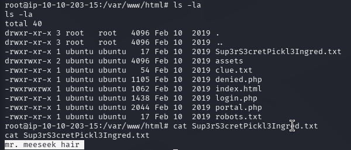

There was also a clue incentivizing me to explore the system further. After some exploration I found the third flag in the root directory.

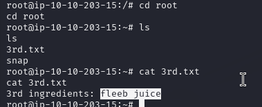

Since I was not finding the second flag I went to shadow to get the systems passwords and to check if the flag was hidden there becouse of the relevancy of the directory. I found out that there was no password access. 

After that I returned to check the file denied.php which led me to try to access some referenced sections inside. Also found a commented base64 text. After decoding several layers of base64 found some trap text "rabbit hole".

After some unfructuous in-depth manual exploration of the system I finally found a "rick" directory that contained the second flag.

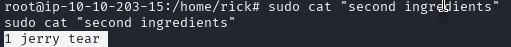

With this all flags were retrieved and the CTF was completed.

## What I learned

Besides the technical hands-on practice, I also learned to meticulously complete each phase and to not get ahead of where I actually am. The second flag took a lot of time to find since I did not explore the system properly and started going for more complex exploration without finishing the basic procedure with the permissions I had at the moment. It was as simple as looking for the machine owner's name. 

